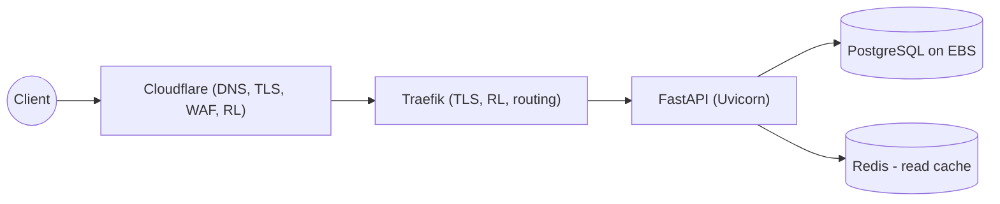
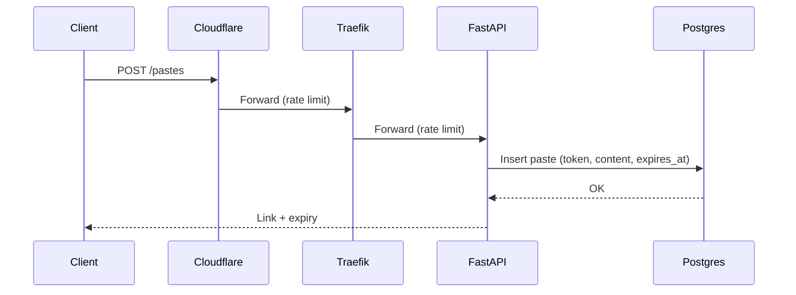
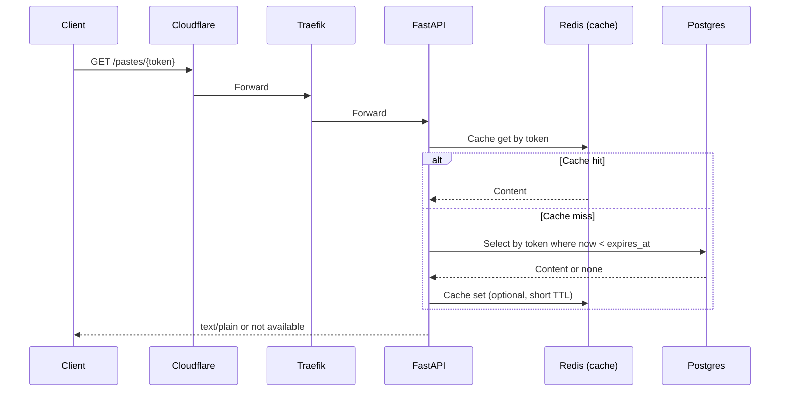

# Architecture — Notes Paste Bin

## Context and Goals

- Simple service to share plain-text via short links with expiration.
- MVP: API-only (separate React app soon), minimal ops cost, single EC2.
- Storage now: PostgreSQL + Redis; scale path to Citus/Cockroach and ElastiCache.

## Tech Stack (current → later)

- Backend: Python 3.14 + FastAPI (Uvicorn workers)
- Storage: PostgreSQL (EBS), Redis (read cache)
- Edge/Proxy: Cloudflare → Traefik (Docker Compose)
- UI: Separate React + Tailwind app (delivered separately; not in MVP)
- Containerization: Docker + Compose (EC2)
- Future: RDS/ElastiCache, ALB or Cloudflare Load Balancing, EKS, Citus/Cockroach

## High-level Architecture

## Components and Responsibilities

- Traefik: TLS termination, routing, per-route rate limit, access logs.
- FastAPI: REST endpoints for paste create/retrieve, health, CORS.
- PostgreSQL: authoritative storage of pastes; schema includes expiry.
- Redis: optional read cache for hot reads.

## Data Model (initial)

- pastes
  - token (varchar(11), primary key; Base62-encoded Snowflake ID)
  - snowflake_id (bigint, unique, indexed; original 64-bit Snowflake for ordering/audit)
  - content (text)
  - content_type (varchar(255))
  - size_bytes (int)
  - sha256 (varchar(64))
  - created_at (timestamptz)
  - expires_at (timestamptz, indexed)

Notes:

- **Primary key is `token`** (not `snowflake_id`) for Citus/sharding compatibility
- All queries are by token → perfect data locality when sharded on token
- Snowflake ID retained for temporal ordering and audit trail
- Enforce expiry at read; periodic purge is post-MVP
- Token entropy sufficient to prevent guessing

## API Surface (resource level)

- POST /pastes: create paste with content and expiration (custom up to 7 days)
- GET /pastes/{token}: retrieve paste (raw text/plain by default)

(No methods/status codes specified in requirements; full contract will be in API design.)

## Token Generation

- Goal: minimal-length, globally unique, opaque, k-sortable IDs supporting billions/day and multi-year horizon.
- Algorithm: 64-bit Snowflake-style ID → keyed 64-bit Feistel permutation (obfuscation) → Base62 encode.
  - 64-bit layout (example): 41 bits timestamp (ms since custom epoch) + 10 bits worker + 12 bits sequence.
  - Throughput: ~4M IDs/sec per worker; monotonic within worker.
  - Base62 of 64 bits fits in 11 characters (ceil(64/log2 62)).
- Storage:
  - `token` (11-char Base62) as PRIMARY KEY - **enables efficient Citus sharding**
  - `snowflake_id` (bigint, unique) for temporal ordering/audit
- Rationale:
  - **Shard-friendly**: All queries by token → perfect data locality in Citus
  - Deterministic uniqueness via Snowflake guarantees
  - Short, URL-safe tokens
  - Snowflake ID embedded in worker ID enables horizontal scaling

## Security

- Serve paste retrieval as text/plain by default; avoid HTML injection.
- Do not log content; minimal metadata logging.
- CORS: restrict to the UI origin; authentication not in MVP.
- Secrets not exposed in logs.

## Rate Limiting (layered)

- Cloudflare: coarse per-IP rules for create.
- Traefik: route-level rateLimit middleware (create stricter than retrieve).
  (No app-level rate limiting in current scope.)

## Observability

- Health endpoint; access logs (Traefik + app).
- Metrics: Prometheus + Grafana stack; no CloudWatch in current scope.

## Deployment (MVP)

- Single EC2 with Docker Compose: traefik, api, postgres (EBS), redis.
- DNS via Cloudflare; TLS via Traefik. Note: Cloudflare Tunnel is a viable alternative to opening inbound ports.
- Backups: out of scope for MVP.

## Runtime Flows

### Create Paste

### Retrieve Paste

## Decisions (current)

- Single EC2; Docker Compose.
- Traefik + Cloudflare edge (Tunnel optional alternative).
- PostgreSQL (EBS) + Redis now; path to Citus/Cockroach and ElastiCache later.
- Separate React app (not included in MVP build/deploy); API-first MVP.
- Backups: out of scope for MVP.

## Scale Path (summary)

- Data: move Postgres → RDS; Redis → ElastiCache.
- Compute: add a second node; introduce ALB or Cloudflare Load Balancing.
- Platform: migrate to EKS with Ingress; optionally Citus/Cockroach.

